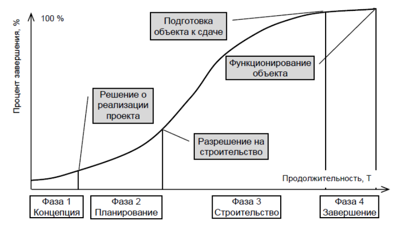
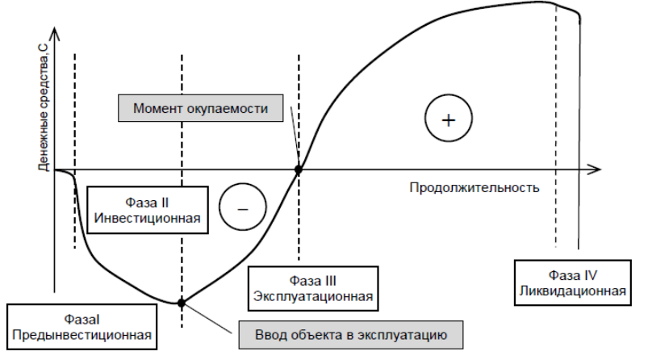
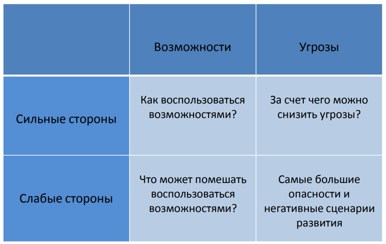
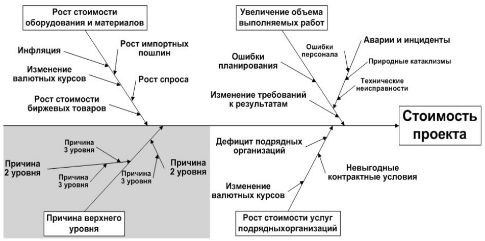

### 1, ОТН. Дать определение. Внешние и внутренние факторы. Кривая Маклими. Потеря информации. Проектный треугольник.

Организационно техническая надежность (ОТН) - способность, существующая вероятность запроектированных решений **сохранять параметры функционирования**(быть выполненных) в рамках установленной (бюджета и сроков) концепции строительного проекта и с заданным уровнем качества. (один из основных показателей надежности строительных процессов).

**Внутренние факторы**: неблагоприятные природно-климатические условия; неисправность машин; выход из строя сетей энерго- и водоснабжения.

**Внешние факторы**: недостаточное количество рабочих на строительной площадке; низкоквалифицированные кадры; нарушение технологии выполнения работ; несоблюдение графика работ.

 На графике **кривой Маклими** показано, что при использовании технологий цифрового моделирования сдвигаются усилия на разработку модели на начальные стадии жизненного цикла, что способствует более дешевому и легкому внесению изменений.

При применении традиционных рабочих процессов может возникнуть ситуация потери какой либо информации (ошибка объемов работ, ошибка в чертежах и т.д.) при переходе на разные этапы проекта. Но при использовании цифровых рабочих процессов потеря информации становится минимальной.

Проектный треугольник отображает какие ключевые показатели проекта были достигнуты и что нужно чтобы их достичь. (Вовремя, в рамках бюджета, с установленным качеством).

### 2, Организационно-технологическая проектная документация. Подготовка строительного производства.

Организационно-технологическая проектная документация отражает решения по организационно-технологической подготовке строительного производства. В нее входят: Проект организации строительства (ПОС); проект производства работ(ППР); руководства по качеству; стандарты предприятия; схемы контроля качества; проекты организации работ(ПОР); карты трудовых процессов.

Подготовка строительного производства проходит в три этапа:

1. общая организационно-технологическая подготовка (выполняется до начала работ на строительной площадке)
2. подготовка к строительству объекта (включая вне- и внутриплощадочные работы, связанные с освоением и организацией стройплощадки и прилегающих территорий)
3. планово-экономические мероприятия

### 3, Проект организации строительства (ПОС).

**ПОС** - раздел проектной документации на объект строительства, определяющий основные организационно-технические решения по осуществлению строительства данного объекта. При его разработке определяются объемы, сроки строительства, потребность в ресурсах и технология строительных работ.

Состоит из **текствой части и графической информации**.

**Цели**: ввод объекта в действие в плановый срок за счет обеспечения соответствующего уровня строительства. Служит основой для распределения капитальных вложений и объемов Строительно монтажных работ по этапа и срокам строительства.

**Состав ПОС**: календарный план строительства, строительный генеральный план, ведомость объемов работ, графики потребностей, краткая пояснительная записка.

Исходные данные для разработки ПОС: технико-экономическое обоснование строительства(ТЭО); задание на проектирование; рекомендованные решения по применению материалов и конструкций, средст механизации СМР; данные об условиях поставок строительных материалов, конструкций, оборудования; специальные требования к строительству сложных и уникальных объектов; и т.д.

Все эти исходные данные необходимо перенести в информационный формат, из этого составляется объем работ необходимый для осздания цифрового ПОС.

### 4, Проект производства работ (ППР).

**ППР** - комплект документов, определяющий порядок выполнения работ и их ресурсного обеспечения.

Может быть разработан на: возведение отдельных частей здания и сооружения; строительство зданий в целом; работы подготовительного периода.

**ППР** - документ, разрабатываемый для реализации проекта и проектной документации, определяющий технологии строительных работ, качество выполнения, сроки, ресурсы, мероприятия по безопасности.

**Исходные данных для разработки ППР**: ПОС; условия поставок строительных материалов, оборудования; условия использования строительных машин; условия обеспечения рабочими кадрами; условия перевозки строительных грузов.

### 5, Проектирование строительных генеральных планов.

**СГП** - чертеж, предназначенный для определения состава и размещения объектов строительного хозяйства на строительной площадке в целях максимальной эффективности их использования.

Должны быть показаны: границы строительной площадки; размещение объекта строительства; размещение грузоподъемных машин; схемы расстановки и движения строительных машин; зоны опасных факторов; площадки для складирования; схемы дорог; объекты бытового городка; инженерные сети.

### 6, Цифровой ПОС. Проблематика перехода к «Цифровому ПОС». Цифровой ПОС и 4D модель.

Цифровой ПОС - информационная модель процесса строительства разработанная на основе сводной цифровой модели (модель собранная вместе и проверенная) и стройгенплан (ограждения, временные здания и т.д.), графики и ведомости ресурсов и стоимость, календарно-сетевой график.

Он показывает, как разработанные проектные решения будут воплощаться в процессе производства.

Проблема перехода: низкий уровень зрелости методологий, инстрементов, сервисов, культуры применения ТИМ; отсутствие культуры применения; отсутствие цифровых баз технологических карт; требования к моделям не учитывают потребности в моделировании ПОС; 

Цифровой ПОС и 4D модели: 4D модели встречаются чаще, т.к. в них не отражены все решения, которые должны быть в цифровом ПОС

### 7, Дать определение проектной деятельности. В чем разница между проектной и операционной деятельностью? Что такое проект? Проект как процесс перевода системы из исходного состояния в заданное. Проектный треугольник.

**Проектная деятельность** - детальная разработка проблемы, при ограниченных условиях сроков и ресурсов, завершающаяся определенным практическим результатом.

**Отличие** заключается в уникальности по содержанию решаемых задач с индивидуальным составом исполнителей на каждый проект. Обычная деятельность - повторение одних и тех же действий одним и тем же составом.

**Проект** - целенаправленное изменение материальной системы с требованиями к качеству результатов, пределом расхода средств и ресурсов.

Вход (Наличие потребностей) -> Проект (Ограничения(финансы, время, власть, право, окружение) + Обеспечение(люди, машины, материалы, технологии)) -> Выход (удовлетворение потребностей)

**Проектный треугольник** строится на продолжительности, стоимости, качестве.

### 8, Жизненный цикл проекта. Описать все фазы. Нарисовать график «затраты/время».

Состоит из 4 фаз:

1. Концепция: определение проекта, оценка, анализ осуществимости, разработка стратегии.
2. Разработка: формирование команды, разработка осн. содержания, планирование, организация и проведение торгов, разработка проектной и сметной документации, детальное планирование.
3. Реализация: строительно-монтажные работы, поставки материалов и оборудования.
4. Завершение: подготовка документации, комиссии, устранение дефектов, подведение итогов.

### 9, Жизненный цикл проекта. Описать все фазы. Нарисовать график «процент завершения/продолжительность».

см. 8 вопрос

### 10, Жизненный цикл проекта. Описать все фазы. Нарисовать график «денежные средства/продолжительность».

см. 8 вопрос

### 11, Что такое «управление проектом»? Основной международный стандарт в области управления проектами. Какие управленческие подходы вы знаете. Основные управляемые параметры проекта.

**Управление проектом** - методология планирования, организации, контроля и координации задач и ресурсов проекта, направленное на своевременное достижение целей проекта.

**Основной международный стандарт** в области управления проектами: **ISO 10006** Управление качеством – Руководство по качеству при управлении проектами

Подходы: 

1. Проектно-ориентированное управление - подход, в котором отдельные задачи, рассматриваются как отдельные проекты.
2. Система "ускоренного строительства" - подход управления проектами, при котором заключается договор строительства "под ключ".

Основные управляемые параметры проекта: Предметная область, стоимость, время, качество, ресурсы.

### 12, Классификация проектов.

По классу: монопроект, мультипроект, мегапроект

По типу: технический, организационный, экономический, социальный, смешанный

По виду: инвестиционный, инновационный, учебно-образовательный, научно-исследовательский, смешанный

По масштабу: малый, средний, крупный, очень крупный

По продолжительности: кратко-, средне-, долгосрочный

По сложности: простой, сложный, очень сложный

### 13, Окружение проекта.

Окружение проекта - среда, оказывающая воздействия на проект, способствующая или препятствующая достижению целей.

Внешнее: 

1. Дальнее: политика, экономика, право, наука, культура, экология
2. Ближнее: сфера финансов, сфера быта, сфера изготовления, сфера инфраструктуры, сфера очистки и утилизации промышленных отходов

Внутреннее: организация проекта, участники, команда, организация документооборота.

### 14, Основные понятия общего управления.

**Субъект управленя** (управляющая система) - элемент производственно-экономической системы, оказывающий управляющие воздействия на объект управления.

**Объект управления** (управляемая система) - процесс, в котором различные виды ресурсов превращаются в готовую строительную продукцию.

**Функция управления** - вид деятельности, необходимый для оказания эффективного воздействия на объект управления.

### 15, Что такое «процессы»? Группы процессов (стадии) управления проектами.

**Процессы** - последовательности действий, приводящие к достижению отдельных результатов.

Стадии:

- Инициация - деятельность, результатом которой является начало проекта или одной из фаз жизненного цикла.
- Планирование - выработка направления и объема действий для достижения поставленных целей проекта.
- Выполнение - выполнение работ в соотв. с планом.
- Контроль и регулирование - регулярный мониторинг для определения отклонений от плана, выработки воздействий для устранения отклонений.
- Завершение - окончание всех действий по проекту или одной из фаз ЖЦ.

### 16, Планирование проекта. Цель планирования. Сущность планирования. Взаимоотношения между уровнями планирования проекта.

**Цель планирования**: формирование модели осуществления проекта.

**Сущность планирования**: задание целей проекта и обеспечение их достижения (формирование комплекса работ, структуры ресурсов).

1 Уровень - **концептуальное планирование** - формирование основной документации по проекту, тех. требований, календарных планов.

2 Уровень - **Стратегическое планирование** - формирование долгосрочных календ. планов выполнения работ, с поледующим объединением в единый план проекта.

3 Уровень - **Тактическое планирование** - детализация решений с верхних уровней, обеспечение организации и контроля работ.

### 17, Контроль и мониторинг проекта. Примеры из практики.

**Контроль проекта** - сравнения фактических параметров выполнения работ с плановыми, анализ отклонений, оценка решений.

**Мониторинг** - сбор, анализ и учет данных по факт. выполнению проекта, составление отчетов сравнение факта с планом.

### 18, Структура проекта. Структуризация. Методы структуризации проекта. Основные модели структуризации проекта.

**Структура проекта** - совокупность элементов и процессов проекта, представленных с различной степенью детализации.

**Структуризация** - разделение проекта на составляющие элементы и установка взаимосвязей между ними.

**Методы**: 

1. Сверху вниз - по принципу детализации, разбиение общих задач на отдельные составляющие.
2. Снизу вверх - по принципу обобщения, сперва определяют частные задачи, а затем их объединение в одно целое.
3. Комбинация методов 1 и 2.

**Основные модели**:

- Структурная декомпозиция работ(СДР) - предназначена для последовательного разделения проекта на блоки, вплоть до отдельных работ.
- Структурная декомпозиция организации проекта (СДО) - графическая модель, предназначенная для представления структуры, необходимой для выполнения работ в составе СДР.
- Матрица распределения ответственности - таблица распределения ответственности за реализацию работ по проекту с указанием роли каждого исполнителя.
- Сетевая модель проекта - инструмент для обеспечения выполнения работ и завершения проекта. 

### 19, Финансирование. Стадии финансирования проекта. Жизнеспособность проекта. Финансовая реализуемость. Что такое денежный поток (в том числе из чего он состоит), оттоки, притоки, смета проекта, бюджет проекта, бюджетирование проекта.

**Финансирование** - обеспечение проекта инвестиционными ресурсами.

**Стадии финансирования**:

- Изучение жизнеспособности проекта
- Организация финансирования
- Формирование плана осуществления проекта
- Контроль и регулирование исполнения плана и условий финансирования

**Жизнеспособность проекта** - способность проекта генерировать доходы, которые покрывают издержки и получение запланированной прибыли в течении ЖЦ проекта.

**Финансовая реализуемость** - хар-ка возможности осуществления проекта по критерию обеспеченности средствами.

**Денежный поток** - накопленная разница между оттоками и притоками с начала проекта. Состоит из частных потоков от инвестиционной, операционной и финансовой видов деятельности.

Денежные средства, поступающие от участников в проект, называются **притоками**, а средства, поступающие из проекта к участникам – **оттоками**.

**Смета проекта** - перечень расходов и доходов по проекту.

**Бюджет проекта** - распределение расходов и доходов по периодам времени.

**Бюджетирование проекта** - совокупность процессов формирования, учета, и контроля исполнения бюджетов.

 

### 20, Эффективность инвестиционного проекта. Оценка эффективности проекта. Основные показатели эффективности инвестиционного проекта: период окупаемости проекта, чистый доход, чистый дисконтированный доход, индекс доходности (рентабельности).

**Эффективность инвестиционного проекта** - хар-ет степень соответствия проекта целям и интересам его участников.

**Оценка эффективности** - принятие решения стоит ли реализовывать проект.

**Период окупаемости проекта** – количество лет, за которое сумма денежных поступлений от проекта будет эквивалентна первоначальным инвестициям.

Чистая приведенная стоимость (**чистый дисконтированный доход**) (Net present value – NPV) – накопленное сальдо денежного потока за весь расчетный период с учетом дисконтирования.

**Индекс доходности** (рентабельности) (Profitability index – PI) показывает приведенную стоимость доходов проекта в расчете на единицу затрат и равен отношению приведённых доходов к  приведённым на ту же дату расходам.

### 21, Риск проекта. Этапы процесса управления рисками. Методы идентификации рисков (SWOT анализ, диаграмма Исикавы).

**Риск проекта** - комплекс обстоятельств, которые могут стать причиной снижения доходности проекта.

**Этапы**: 

1. Идентификация рисков
2. Анализ рисков - исследование рисков, определение вероятности их наступления
3. Управление рисками - из результатов анализа, разрабатываются мероприятия предотвращающие риски или минимизирующие.

**SWOT анализ** - метод планирования, выявляющий факторы внутренней и внешней среды организации и разделения на 4 категории: Внутренние(сильные стороны, слабы стороны), Внешние(возможности, угрозы).

**Диаграмма Исикавы** - графический способ определения связей между факторами и проблемами.

### 22, Методы качественного анализа рисков. Что получают в результате качественного анализа рисков проекта?

**Методы**: Анализ вероятности и последствий риска(высокая-низкая, значительная-ничтожная); Матрица вероятности и последствий риска; Оценка достоверности и полезности информации.

В результате получают: ранжирование рисков проекта; установление приоритетности рисков; перечень рисков для доп. анализа; тренды результатов.

### 23, Методы количественного анализа рисков (анализ чувствительности).

**Количественный анализ риска** - определение количественных величин параметров риска.

**Методы**: Анализ чувствительности - определение факторов, в наибольшей степени оказывающих влияние на результаты проекта.

### 24, Методы управления риском.

**Избежание риска** - запланированные мероприятия для избегания воздействий на проект рисков.

**Смягчение риска** - снижение степени воздействия на проект рисковых событий из-за уменьшения вероятности его наступления.

**Передача риска** - уменьшение риска за счет передачи его другим участникам.

**Принятие риска** - когда план проекта не может быть изменен из-за выявленных рисков, либо отсутствии стратегии реагирования на риски.

**Резервирование ресурсов** - наличие резервов.

**Диверсификация** - одновременное развития направлений деятельности.

**Страхование риска** - передача части рисков страховой за плату.

**Хеджирование** - страхование производства от возможных потерь, путем переноса риска с одного лица на другое.

### 25, Что такое устойчивое развитие в строительстве? Перечислите цели устойчивого развития в строительстве. Системы «зеленой» сертификации.

### 26, Что такое энергомоделирование? Как получить максимальный эффект от энергомоделирования? Какие задачи решает CFD моделирование?

### 27, Внедрения технологий: 3 этапа. Варианты перехода на BIM. Переход на BIM с интегратором. Изменение производительности труда.

Для внедрения необходимо:

1. Внедрить регламенты и стандарты взаимодействия в 2D, 3D среде.
2. Системы управления: централизованное хранилище; CDE; Документооборот; управление проектами.
3. 3D/4D/5D модели: информационные модели во всех разделах и этапах проектирования и строительства.

**Варианты перехода**: 1. Переход небольшой группы специалистов. 2. Одновременный переход всех организации. 3. Привлечение специалистов, владеющих технологией.

### 28, Составляющие перехода на BIM. Что требуется для перехода к BIM?

**Составляющие**: BIM процессы, BIM данные, BIM инструменты.

Для перехода требуется: грамотное управление процессом, взаимодействие между отделами разработки BIM, управление изменениями, техническая поддержка BIM. 

### 29, Расчет трудоемкостей отдельных видов работ, формирование комплексов работ и определение их продолжительностей (в т.ч. формулы). Виды строительных процессов. Чем звено отличается от бригады? Что такое комплекс работ? Разбивка общего фронта на частные. Методы НИР и МКР. Что такое общестроительные работы?