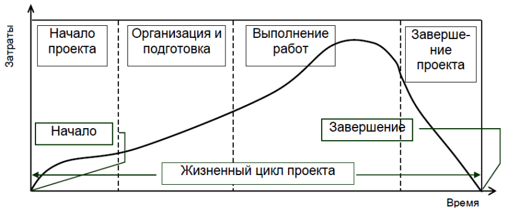

#### 1, ОТН. Дать определение. Внешние и внутренние факторы. Кривая Маклими. Потеря информации. Проектный треугольник.

Организационно техническая надежность (ОТН) - способность, существующая вероятность запроектированных решений **сохранять параметры функционирования**(быть выполненных) в рамках установленной (бюджета и сроков) концепции строительного проекта и с заданным уровнем качества. (один из основных показателей надежности строительных процессов).

**Внутренние факторы**: неблагоприятные природно-климатические условия; неисправность машин; выход из строя сетей энерго- и водоснабжения.

**Внешние факторы**: недостаточное количество рабочих на строительной площадке; низкоквалифицированные кадры; нарушение технологии выполнения работ; несоблюдение графика работ.

 На графике **кривой Маклими** показано, что при использовании технологий цифрового моделирования сдвигаются усилия на разработку модели на начальные стадии жизненного цикла, что способствует более дешевому и легкому внесению изменений.

При применении традиционных рабочих процессов может возникнуть ситуация потери какой либо информации (ошибка объемов работ, ошибка в чертежах и т.д.) при переходе на разные этапы проекта. Но при использовании цифровых рабочих процессов потеря информации становится минимальной.

Проектный треугольник отображает какие ключевые показатели проекта были достигнуты и что нужно чтобы их достичь. (Вовремя, в рамках бюджета, с установленным качеством).

#### 2, Организационно-технологическая проектная документация. Подготовка строительного производства.

Организационно-технологическая проектная документация отражает решения по организационно-технологической подготовке строительного производства. В нее входят: Проект организации строительства (ПОС); проект производства работ(ППР); руководства по качеству; стандарты предприятия; схемы контроля качества; проекты организации работ(ПОР); карты трудовых процессов.

Подготовка строительного производства проходит в три этапа:

1. общая организационно-технологическая подготовка (выполняется до начала работ на строительной площадке)
2. подготовка к строительству объекта (включая вне- и внутриплощадочные работы, связанные с освоением и организацией стройплощадки и прилегающих территорий)
3. планово-экономические мероприятия

#### 3, Проект организации строительства (ПОС).

**ПОС** - раздел проектной документации на объект строительства, определяющий основные организационно-технические решения по осуществлению строительства данного объекта. При его разработке определяются объемы, сроки строительства, потребность в ресурсах и технология строительных работ.

Состоит из **текствой части и графической информации**.

**Цели**: ввод объекта в действие в плановый срок за счет обеспечения соответствующего уровня строительства. Служит основой для распределения капитальных вложений и объемов Строительно монтажных работ по этапа и срокам строительства.

**Состав ПОС**: календарный план строительства, строительный генеральный план, ведомость объемов работ, графики потребностей, краткая пояснительная записка.

Исходные данные для разработки ПОС: технико-экономическое обоснование строительства(ТЭО); задание на проектирование; рекомендованные решения по применению материалов и конструкций, средст механизации СМР; данные об условиях поставок строительных материалов, конструкций, оборудования; специальные требования к строительству сложных и уникальных объектов; и т.д.

Все эти исходные данные необходимо перенести в информационный формат, из этого составляется объем работ необходимый для осздания цифрового ПОС.

#### 4, Проект производства работ (ППР).

**ППР** - комплект документов, определяющий порядок выполнения работ и их ресурсного обеспечения.

Может быть разработан на: возведение отдельных частей здания и сооружения; строительство зданий в целом; работы подготовительного периода.

**ППР** - документ, разрабатываемый для реализации проекта и проектной документации, определяющий технологии строительных работ, качество выполнения, сроки, ресурсы, мероприятия по безопасности.

**Исходные данных для разработки ППР**: ПОС; условия поставок строительных материалов, оборудования; условия использования строительных машин; условия обеспечения рабочими кадрами; условия перевозки строительных грузов.

#### 5, Проектирование строительных генеральных планов.

**СГП** - чертеж, предназначенный для определения состава и размещения объектов строительного хозяйства на строительной площадке в целях максимальной эффективности их использования.

Должны быть показаны: границы строительной площадки; размещение объекта строительства; размещение грузоподъемных машин; схемы расстановки и движения строительных машин; зоны опасных факторов; площадки для складирования; схемы дорог; объекты бытового городка; инженерные сети.

#### 6, Цифровой ПОС. Проблематика перехода к «Цифровому ПОС». Цифровой ПОС и 4D модель.

Цифровой ПОС - информационная модель процесса строительства разработанная на основе сводной цифровой модели (модель собранная вместе и проверенная) и стройгенплан (ограждения, временные здания и т.д.), графики и ведомости ресурсов и стоимость, календарно-сетевой график.

Он показывает, как разработанные проектные решения будут воплощаться в процессе производства.

Проблема перехода: низкий уровень зрелости методологий, инстрементов, сервисов, культуры применения ТИМ; отсутствие культуры применения; отсутствие цифровых баз технологических карт; требования к моделям не учитывают потребности в моделировании ПОС; 

Цифровой ПОС и 4D модели: 4D модели встречаются чаще, т.к. в них не отражены все решения, которые должны быть в цифровом ПОС

#### 7, Дать определение проектной деятельности. В чем разница между проектной и операционной деятельностью? Что такое проект? Проект как процесс перевода системы из исходного состояния в заданное. Проектный треугольник.

**Проектная деятельность** - детальная разработка проблемы, при ограниченных условиях сроков и ресурсов, завершающаяся определенным практическим результатом.

**Отличие** заключается в уникальности по содержанию решаемых задач с индивидуальным составом исполнителей на каждый проект. Обычная деятельность - повторение одних и тех же действий одним и тем же составом.

**Проект** - целенаправленное изменение материальной системы с требованиями к качеству результатов, пределом расхода средств и ресурсов.

Вход (Наличие потребностей) -> Проект (Ограничения(финансы, время, власть, право, окружение) + Обеспечение(люди, машины, материалы, технологии)) -> Выход (удовлетворение потребностей)

**Проектный треугольник** строится на продолжительности, стоимости, качестве.

#### 8, Жизненный цикл проекта. Описать все фазы. Нарисовать график «затраты/время».

Состоит из 4 фаз:

1. Концепция: определение проекта, оценка, анализ осуществимости, разработка стратегии.
2. Разработка: формирование команды, разработка осн. содержания, планирование, организация и проведение торгов, разработка проектной и сметной документации, детальное планирование.
3. Реализация: строительно-монтажные работы, поставки материалов и оборудования.
4. Завершение: подготовка документации, комиссии, устранение дефектов, подведение итогов.

#### 9, Жизненный цикл проекта. Описать все фазы. Нарисовать график «процент завершения/продолжительность».

#### 10, Жизненный цикл проекта. Описать все фазы. Нарисовать график «денежные средства/продолжительность».

#### 11, Что такое «управление проектом»? Основной международный стандарт в области управления проектами. Какие управленческие подходы вы знаете. Основные управляемые параметры проекта.

#### 12, Классификация проектов.

#### 13, Окружение проекта.

#### 14, Основные понятия общего управления.

#### 15, Что такое «процессы»? Группы процессов (стадии) управления проектами.

#### 16, Планирование проекта. Цель планирования. Сущность планирования. Взаимоотношения между уровнями планирования проекта.

#### 17, Контроль и мониторинг проекта. Примеры из практики.

#### 18, Структура проекта. Структуризация. Методы структуризации проекта. Основные модели структуризации проекта.

#### 19, Финансирование. Стадии финансирования проекта. Жизнеспособность проекта. Финансовая реализуемость. Что такое денежный поток (в том числе из чего он состоит), оттоки, притоки, смета проекта, бюджет проекта, бюджетирование проекта.

#### 20, Эффективность инвестиционного проекта. Оценка эффективности проекта. Основные показатели эффективности инвестиционного проекта: период окупаемости проекта, чистый доход, чистый дисконтированный доход, индекс доходности (рентабельности).

#### 21, Риск проекта. Этапы процесса управления рисками. Методы идентификации рисков (SWOT анализ, диаграмма Исикавы).

#### 22, Методы качественного анализа рисков. Что получают в результате качественного анализа рисков проекта?

#### 23, Методы количественного анализа рисков (анализ чувствительности).

#### 24, Методы управления риском.

#### 25, Что такое устойчивое развитие в строительстве? Перечислите цели устойчивого развития в строительстве. Системы «зеленой» сертификации.

#### 26, Что такое энергомоделирование? Как получить максимальный эффект от энергомоделирования? Какие задачи решает CFD моделирование?

#### 27, Внедрения технологий: 3 этапа. Варианты перехода на BIM. Переход на BIM с интегратором. Изменение производительности труда.

#### 28, Составляющие перехода на BIM. Что требуется для перехода к BIM?

#### 29, Расчет трудоемкостей отдельных видов работ, формирование комплексов работ и определение их продолжительностей (в т.ч. формулы). Виды строительных процессов. Чем звено отличается от бригады? Что такое комплекс работ? Разбивка общего фронта на частные. Методы НИР и МКР. Что такое общестроительные работы?